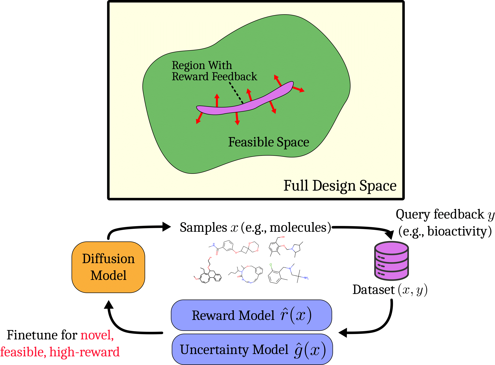
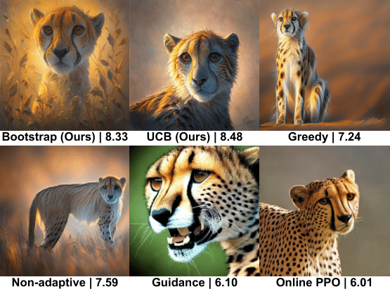

<div align="center">

<!-- TITLE -->
# **Feedback Efficient Online Fine-Tuning of Diffusion Models**  



[](https://arxiv.org/abs/2402.16359) [](https://openreview.net/forum?id=dtVlc9ybTm)
</div>

This is the official implementation of the paper [Feedback Efficient Online Fine-Tuning of Diffusion Models](https://arxiv.org/abs/2402.16359) accepted by ICML 2024.

## Lab-in-the-loop Diffusion Models Fine-tuning

This study presents **SEIKO** (Optimi**S**tic fin**E**-tuning of d**I**ffusion with **K**L c**O**nstraint), a novel reinforcement learning method to efficiently fine-tune diffusion models, targeting high-reward regions on the feasible manifold. The approach is validated both theoretically and empirically across images, biological sequences, and molecules. This repository includes the codebase for fine-tuning a pre-trained Stable Diffusion model in the image domain.

## Abstract

Diffusion models excel at modeling complex data distributions, including those of images, proteins, and small molecules. However, in many cases, our goal is to model parts of the distribution that maximize certain properties. For example, we may want to generate images with high aesthetic quality, or molecules with high bioactivity. It is natural to frame this as a reinforcement learning (RL) problem, in which the objective is to fine-tune a diffusion model to maximize a reward function that corresponds to some property. Even with access to online queries of the ground-truth reward function, efficiently discovering high-reward samples can be challenging: they might have a low probability in the initial distribution, and there might be many infeasible samples that do not even have a well-defined reward (e.g., unnatural images or physically impossible molecules). In this work, we propose a novel reinforcement learning procedure that efficiently explores on the manifold of feasible samples. We present a theoretical analysis providing a regret guarantee, as well as empirical validation across three domains: images, biological sequences, and molecules.

## Code

### Installation 

Create a conda environment with the following command:

```bash
conda create -n SEIKO python=3.10
conda activate SEIKO
pip install -r requirements.txt
```
Please use accelerate==0.17.0; other library dependencies might be flexible.

### Training

HuggingFace Accelerate will automatically handle parallel training.  
We conducted our experiments on image tasks using 4 A100 GPUs. Please adjust the `config.train.batch_size_per_gpu_available` variable in the config files according to your GPU memory.  

#### Running Non-adaptive (Baseline)  

```bash
accelerate launch online/online_main.py --config config/Non-adaptive.py:aesthetic
```

#### Running Greedy (Baseline)  

```bash
accelerate launch online/online_main.py --config config/Greedy.py:aesthetic
```

#### Running SEIKO-UCB  

```bash
accelerate launch online/online_main.py --config config/UCB.py:aesthetic
```

#### Running SEIKO-Bootstrap  

```bash
accelerate launch online/online_main.py --config config/Bootstrap.py:aesthetic
```

#### Running SEIKO-TS  

```bash
accelerate launch online/online_main.py --config config/TS.py:aesthetic
```

### Evaluation

When evaluating a saved model checkpoint, the `resume_from` variable must be specified. Below is an example for evaluating **Greedy**. Evaluations for other methods are similar.

#### Evaluating Greedy (Baseline)
```bash
accelerate launch online/online_main.py --config config/Greedy.py:evaluate --config.resume_from path-to-ckpt
```

#### Results

The table below presents performances for fine-tuning Stable Diffusion to optimize aesthetic scores. **SEIKO** (UCB and Bootstrap) attains high rewards within a fixed budget.

|            Algorithms                     | Value ↑           |
|---------------------------------|-------------------|
| **Non-adaptive**                | $7.22 \pm 0.18$   |
| **Guidance**                    | $5.78 \pm 0.28$   |
| **Online PPO**                  | $6.13 \pm 0.33$   |
| **Greedy**                      | $6.24 \pm 0.28$   |
| **UCB (Ours)**                  | **$8.17 \pm 0.33$** |
| **Bootstrap (Ours)**            | $7.77 \pm 0.12$   |

#### Qualitative Examples

Generated images with aesthetic scores using the prompt "cheetah" are shown below. Our methods outperform the baselines with higher aesthetic scores while using the same amount of feedback.


### Acknowledgement

Our codebase is directly built on top of [AlignProp](https://github.com/mihirp1998/AlignProp/) and [DDPO](https://github.com/kvablack/ddpo-pytorch).  We are thankful to the authors for providing the codebases.

## Citation

If you find this work useful in your research, please cite:

```bibtex
@inproceedings{
uehara2024feedback,
title={Feedback Efficient Online Fine-Tuning of Diffusion Models},
author={Masatoshi Uehara and Yulai Zhao and Kevin Black and Ehsan Hajiramezanali and Gabriele Scalia and Nathaniel Lee Diamant and Alex M Tseng and Sergey Levine and Tommaso Biancalani},
booktitle={Forty-first International Conference on Machine Learning},
year={2024},
url={https://openreview.net/forum?id=dtVlc9ybTm}
}
```
